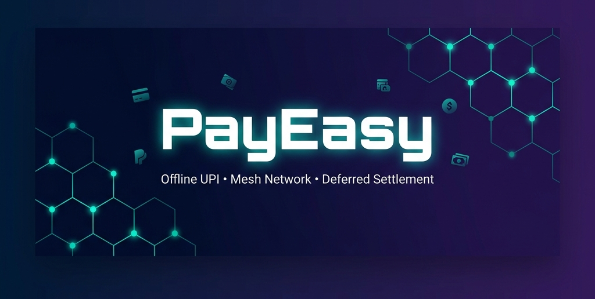
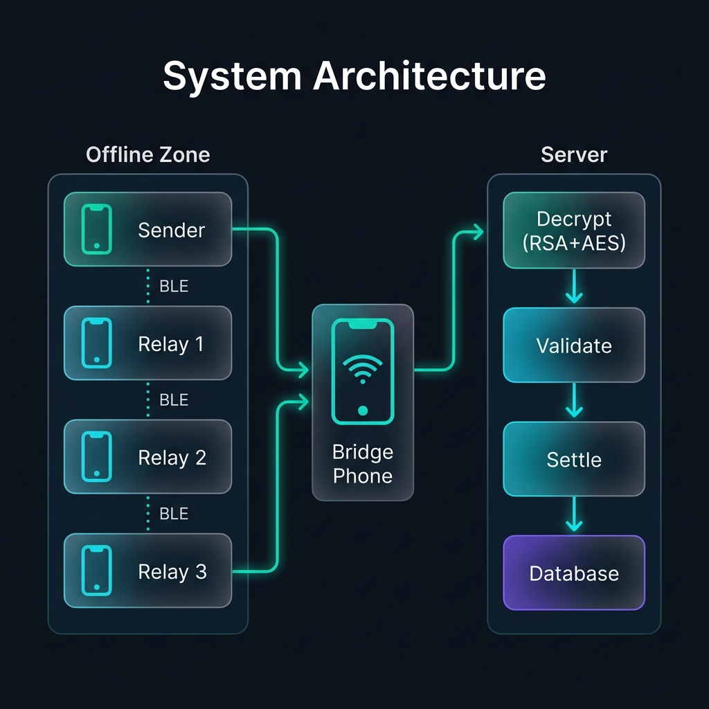
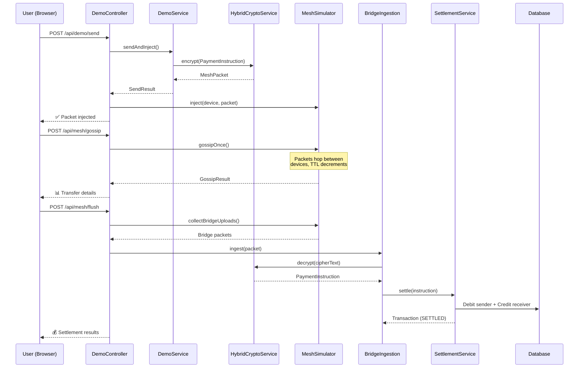
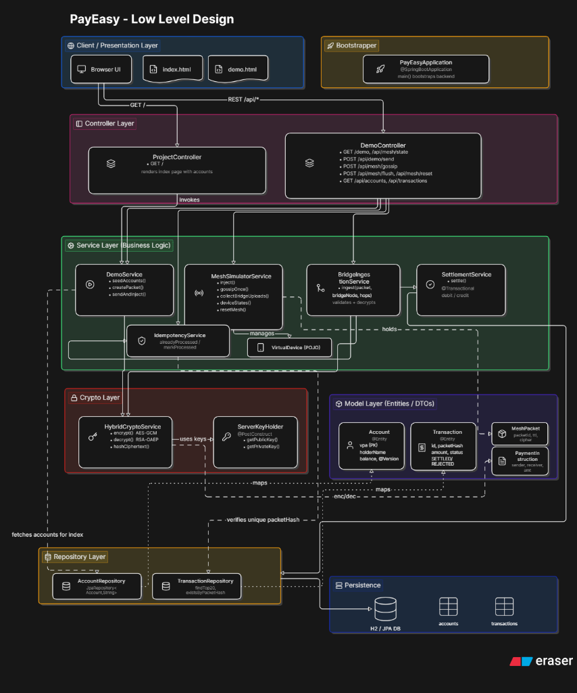
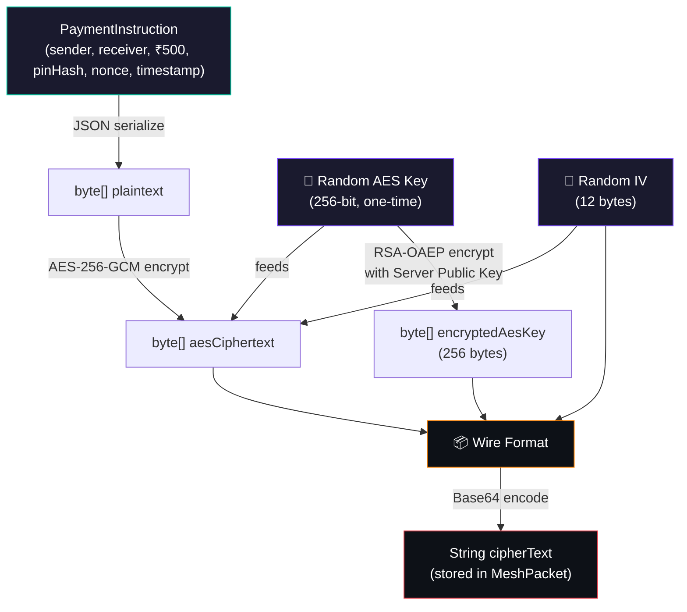
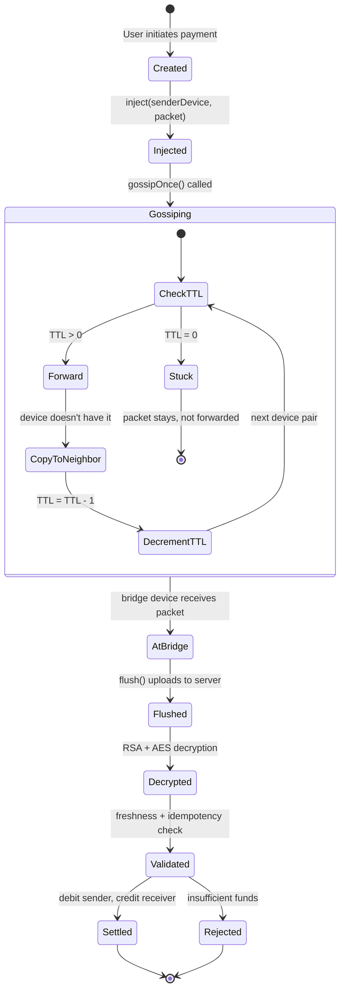
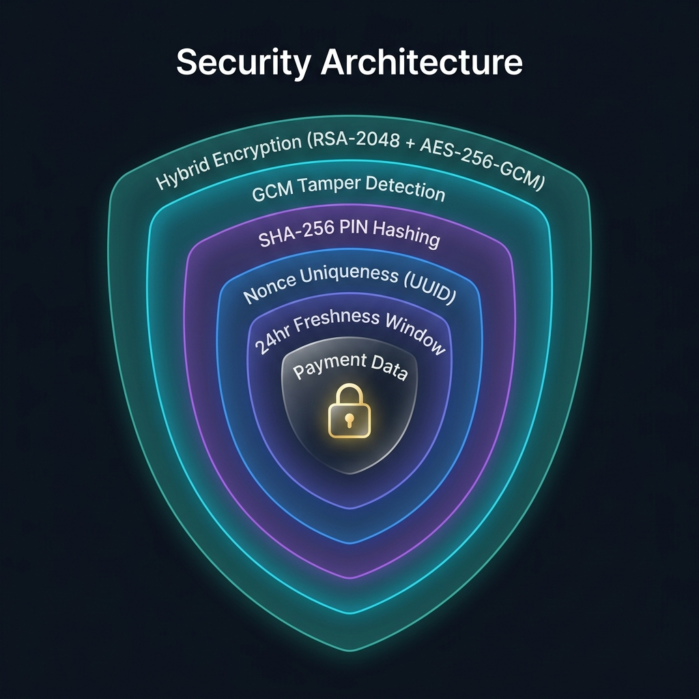

<p align="center">
  
</p>

<p align="center">
  <strong>Offline UPI Payments via Bluetooth Mesh Network with Deferred Settlement</strong>
</p>

<p align="center">
  <a href="#-quick-start"></a>
  <a href="#-architecture"></a>
  <a href="#-low-level-design-lld"></a>
  <a href="#-security"></a>
  <a href="#-api-reference"></a>
</p>

<p align="center">
  <a href="https://easypay-production-25fc.up.railway.app/"></a>
  
  
  
  
  
  
</p>

---

## What is PayEasy?

> **PayEasy** demonstrates how UPI-like digital payments can work **without any internet connectivity** — using a Bluetooth mesh network to relay encrypted payment packets between phones, and settling them only when one phone eventually reaches internet.
>
> 🔴 **[Test the Live Simulation Engine Here](https://easypay-production-25fc.up.railway.app/)**

Imagine you're in a **basement**, **parking lot**, or **rural area** with no signal. You need to pay someone ₹500. With PayEasy:

<table>
<tr>
<td width="25%" align="center">
<h3>📱 Step 1</h3>
<strong>Create Payment</strong><br/>
Your phone encrypts the payment with military-grade hybrid crypto
</td>
<td width="25%" align="center">
<h3>📡 Step 2</h3>
<strong>Mesh Gossip</strong><br/>
The encrypted packet hops between nearby phones via Bluetooth
</td>
<td width="25%" align="center">
<h3>🌐 Step 3</h3>
<strong>Bridge Upload</strong><br/>
When any relay phone gets internet, it uploads the packet to the server
</td>
<td width="25%" align="center">
<h3>✅ Step 4</h3>
<strong>Settlement</strong><br/>
Server decrypts, validates, and settles — sender debited, receiver credited
</td>
</tr>
</table>

---

## Key Features

<table>
<tr>
<td width="50%">

### 🔒 Military-Grade Encryption
- **RSA-2048 OAEP** for key exchange
- **AES-256-GCM** for payload encryption
- **GCM authentication tags** for tamper detection
- Zero knowledge for relay nodes

</td>
<td width="50%">

### 📡 Mesh Network Simulation
- 5 virtual devices (4 offline + 1 bridge)
- Gossip protocol with TTL-based forwarding
- Realistic Bluetooth Low Energy (BLE) simulation
- Visual packet tracking across devices

</td>
</tr>
<tr>
<td width="50%">

### 🛡️ Anti-Fraud & Replay Protection
- SHA-256 packet hashing (idempotency key)
- Unique nonce per transaction (UUID)
- 24-hour freshness window (stale packet rejection)
- Database-level unique constraint on packet hash

</td>
<td width="50%">

### 💰 Deferred Settlement Engine
- Atomic debit/credit with `@Transactional`
- Optimistic locking (`@Version`) on accounts
- `BigDecimal` precision for financial math
- Full transaction audit trail (SETTLED / REJECTED)

</td>
</tr>
</table>

---

## Quick Start

### Prerequisites

| Tool | Version |
|------|---------|
| Java JDK | 17+ |
| Maven | 3.8+ (or use included wrapper) |

### Run the Application

```bash
# Clone the repository
git clone https://github.com/your-username/PayEasy.git
cd PayEasy/PayEasy

# Run with Maven Wrapper (no Maven installation needed)
./mvnw spring-boot:run
```

### Access Points

| Page | URL | Description |
|------|-----|-------------|
| **Dashboard** | [`localhost:8080`](http://localhost:8080) | Main dashboard with accounts & transactions |
| **Interactive Demo** | [`localhost:8080/demo`](http://localhost:8080/demo) | Step-by-step mesh simulation |
| **H2 Console** | [`localhost:8080/h2-console`](http://localhost:8080/h2-console) | Database browser (JDBC: `jdbc:h2:mem:payeasy`, user: `sa`) |

### Demo Accounts (Auto-seeded)

| VPA | Holder | Balance |
|-----|--------|---------|
| `heru@pay` | Heru | ₹5,000.00 |
| `sheru@pay` | Sheru | ₹1,000.00 |
| `tera@pay` | Tera | ₹2,500.00 |
| `bhaiya@pay` | Bhaiya | ₹500.00 |

---

## Architecture

<p align="center">
  
</p>

### High-Level Architecture

```mermaid
graph LR
    subgraph "📵 Offline Zone"
        A["📱 Sender<br/>phone-heru"] -->|BLE Gossip| B["📱 Relay 1<br/>phone-sheru"]
        B -->|BLE Gossip| C["📱 Relay 2<br/>phone-tera"]
        C -->|BLE Gossip| D["📱 Relay 3<br/>phone-bhaiya"]
    end

    D -->|BLE Gossip| E["📱🌐 Bridge<br/>phone-bridge"]

    subgraph "☁️ Server"
        E -->|HTTP POST| F["🔓 Decrypt"]
        F --> G["✅ Validate"]
        G --> H["💰 Settle"]
        H --> I["🗄️ Database"]
    end

    style A fill:#1a1a2e,stroke:#00d4aa,color:#fff
    style B fill:#1a1a2e,stroke:#00d4aa,color:#fff
    style C fill:#1a1a2e,stroke:#00d4aa,color:#fff
    style D fill:#1a1a2e,stroke:#00d4aa,color:#fff
    style E fill:#1a1a2e,stroke:#7c4dff,color:#fff
    style F fill:#0d1117,stroke:#00bcd4,color:#fff
    style G fill:#0d1117,stroke:#00bcd4,color:#fff
    style H fill:#0d1117,stroke:#00bcd4,color:#fff
    style I fill:#0d1117,stroke:#00bcd4,color:#fff
```



### Component Interaction



---

## Low-Level Design (LLD)

<p align="center">
  
</p>

<p align="center">
  <em>Complete system LLD showing all layers — Client, Controller, Service, Crypto, Model, Repository & Persistence</em>
</p>

### Layer Breakdown

The system follows a **clean layered architecture** with clear separation of concerns:

<table>
<tr>
<td width="20%" align="center"><strong>🖥️ Client Layer</strong></td>
<td>Browser UI with <code>index.html</code> (Thymeleaf dashboard) and <code>demo.html</code> (interactive simulation). Communicates via <code>GET /</code> and <code>REST /api/*</code> endpoints.</td>
</tr>
<tr>
<td align="center"><strong>🎛️ Controller Layer</strong></td>
<td><code>ProjectController</code> renders the dashboard with account data. <code>DemoController</code> exposes REST APIs for mesh simulation — send, gossip, flush, reset, and state queries.</td>
</tr>
<tr>
<td align="center"><strong>⚙️ Service Layer</strong></td>
<td>Core business logic — <code>DemoService</code> (seeds data + creates packets), <code>MeshSimulatorService</code> (gossip engine managing <code>VirtualDevice</code> nodes), <code>BridgeIngestionService</code> (validates + decrypts), <code>SettlementService</code> (atomic debit/credit), and <code>IdempotencyService</code> (anti-replay).</td>
</tr>
<tr>
<td align="center"><strong>🔐 Crypto Layer</strong></td>
<td><code>HybridCryptoService</code> handles AES-GCM encryption/decryption and RSA-OAEP key wrapping. <code>ServerKeyHolder</code> generates and holds the RSA-2048 keypair at startup.</td>
</tr>
<tr>
<td align="center"><strong>📦 Model Layer</strong></td>
<td>JPA entities (<code>Account</code> with <code>@Version</code>, <code>Transaction</code> with unique <code>packetHash</code>) and POJOs (<code>MeshPacket</code> envelope, <code>PaymentInstruction</code> payload).</td>
</tr>
<tr>
<td align="center"><strong>🗄️ Repository Layer</strong></td>
<td><code>AccountRepository</code> (CRUD by VPA) and <code>TransactionRepository</code> (top-20 queries + <code>existsByPacketHash</code>) backed by H2 in-memory database.</td>
</tr>
</table>

### Key Relationships (from the LLD)

```
Controller ──invokes──► Service Layer
DemoService ──creates──► MeshPacket (via HybridCryptoService encryption)
MeshSimulatorService ──manages──► VirtualDevice[] ──holds──► MeshPacket[]
BridgeIngestionService ──validates + decrypts──► PaymentInstruction
SettlementService ──maps──► Account (debit/credit) + Transaction (audit)
IdempotencyService ──verifies unique──► packetHash
HybridCryptoService ──uses keys from──► ServerKeyHolder
Repository Layer ──persists──► H2 Database (accounts + transactions tables)
```

### Package Structure & Responsibilities

```
com.example.PayEasy
│
├── 📂 Model/                        ← Data Transfer & Persistence
│   ├── Account.java                  JPA Entity — bank account (VPA + balance)
│   ├── MeshPacket.java               POJO — encrypted envelope for mesh transit
│   ├── PaymentInstruction.java       POJO — decrypted payment data (inside envelope)
│   └── Transaction.java             JPA Entity — settlement audit record
│
├── 📂 Repository/                   ← Data Access Layer (Spring Data JPA)
│   ├── AccountRepository.java        CRUD for Account (keyed by VPA string)
│   └── TransactionRepository.java    CRUD + findTop20 + existsByPacketHash
│
├── 📂 Service/                      ← Core Business Logic
│   ├── DemoService.java              Seeds accounts + creates encrypted packets
│   ├── MeshSimulatorService.java     BLE mesh simulation (gossip protocol engine)
│   ├── VirtualDevice.java            Single phone node in the mesh
│   ├── BridgeIngestionService.java   Server-side packet processing pipeline
│   ├── SettlementService.java        Atomic debit/credit + transaction recording
│   └── IdempotencyService.java       In-memory + DB duplicate detection
│
├── 📂 cryptoService/                ← Cryptographic Layer
│   ├── HybridCryptoService.java      RSA-2048 + AES-256-GCM encrypt/decrypt engine
│   └── ServerKeyHolder.java          RSA keypair generation & management
│
├── 📂 Controller/                   ← HTTP & UI Layer
│   ├── DemoController.java           REST APIs for mesh demo simulation
│   ├── ProjectController.java        Thymeleaf dashboard controller
│   ├── ApiController.java            (placeholder for future APIs)
│   └── DashboardController.java      (placeholder for future dashboard)
│
└── 📂 config/
    └── AppConfig.java                (placeholder for Spring beans config)
```

### Data Flow — Encryption Pipeline



**Wire format (binary layout):**

```
┌──────────────────────┬────────────┬──────────────────────────────┐
│  RSA-encrypted       │  GCM IV    │  AES-GCM ciphertext          │
│  AES key (256 bytes) │ (12 bytes) │  (payload + 16-byte auth tag)│
└──────────────────────┴────────────┴──────────────────────────────┘
```

### Gossip Protocol — State Machine



### Database Schema (H2 — Auto-generated by Hibernate)

```sql
-- accounts table
CREATE TABLE accounts (
    vpa          VARCHAR(255)   PRIMARY KEY,
    holder_name  VARCHAR(255)   NOT NULL,
    balance      DECIMAL(19,2)  NOT NULL,
    version      BIGINT                      -- optimistic locking
);

-- transactions table
CREATE TABLE transactions (
    id             BIGINT AUTO_INCREMENT PRIMARY KEY,
    packet_hash    VARCHAR(64)    NOT NULL UNIQUE,  -- SHA-256 (anti-replay)
    sender_vpa     VARCHAR(255)   NOT NULL,
    receiver_vpa   VARCHAR(255)   NOT NULL,
    amount         DECIMAL(19,2)  NOT NULL,
    signed_at      TIMESTAMP      NOT NULL,
    settled_at     TIMESTAMP      NOT NULL,
    bridge_node_id VARCHAR(255)   NOT NULL,
    hop_count      INT            NOT NULL,
    status         VARCHAR(20)    NOT NULL          -- 'SETTLED' | 'REJECTED'
);

CREATE UNIQUE INDEX idx_packet_hash ON transactions (packet_hash);
```

---

## Security

<p align="center">
  
</p>

### Defense-in-Depth Strategy

| # | Threat | Attack | Defense | Implementation |
|---|--------|--------|---------|----------------|
| 1 | **Eavesdropping** | Relay phones read payment data | Hybrid Encryption | `HybridCryptoService.encrypt()` — RSA-2048 + AES-256-GCM |
| 2 | **Tampering** | Modify packet in transit | GCM Auth Tag | AES-GCM automatically fails if even 1 bit is changed |
| 3 | **Replay Attack** | Re-send captured packet | Idempotency + Freshness | `IdempotencyService` (hash cache) + 24hr `signedAt` check |
| 4 | **Duplicate Tx** | Identical legitimate payments | Nonce | `UUID.randomUUID()` in `PaymentInstruction.nonce` |
| 5 | **PIN Theft** | Extract UPI PIN from packet | SHA-256 Hashing | `Hashing.sha256()` via Google Guava |
| 6 | **Race Condition** | Concurrent balance update | Optimistic Locking | `@Version` on `Account` entity |
| 7 | **Key Compromise** | Steal server private key | Key Isolation | `ServerKeyHolder` — in production, use HSM/KMS |

### Encryption Flow

```
📱 Sender Phone                           ☁️ Server
─────────────                             ─────────

PaymentInstruction ──┐
                     │ JSON
                     ▼
              [AES-256-GCM]
                  │  ▲
     random key ──┘  │
         │           │
         ▼           │
  [RSA-OAEP encrypt  │
   with server       │
   PUBLIC key]       │
         │           │
         ▼           ▼
    ┌─────────────────────┐
    │   MeshPacket        │──── BLE ────►  [RSA decrypt with
    │   (Base64 blob)     │               PRIVATE key]
    └─────────────────────┘                    │
                                               ▼
                                         [AES-GCM decrypt +
                                          verify integrity]
                                               │
                                               ▼
                                         PaymentInstruction ✅
```

---

## API Reference

### Demo Simulation APIs

<details>
<summary><code>POST</code> <code>/api/demo/send</code> — <strong>Create & inject a payment packet</strong></summary>

**Request Body:**
```json
{
  "senderVpa": "heru@pay",
  "receiverVpa": "sheru@pay",
  "amount": 500,
  "pin": "1234",
  "ttl": 5,
  "startDevice": "phone-heru"
}
```

**Response:**
```json
{
  "packetId": "a1b2c3d4-...",
  "shortId": "a1b2c3d4",
  "injectedAt": "phone-heru",
  "senderVpa": "heru@pay",
  "receiverVpa": "sheru@pay",
  "amount": 500,
  "ttl": 5,
  "ciphertextPreview": "RklSU1QgMjU2IEJZVEVTIE9GIFJTQSBFTkNSWV..."
}
```
</details>

<details>
<summary><code>POST</code> <code>/api/mesh/gossip</code> — <strong>Run one gossip round</strong></summary>

**Response:**
```json
{
  "transfers": 4,
  "deviceCounts": {
    "phone-heru": 1,
    "phone-sheru": 1,
    "phone-tera": 1,
    "phone-bhaiya": 1,
    "phone-bridge": 1
  },
  "transferDetails": [
    {
      "from": "phone-heru",
      "to": "phone-sheru",
      "packetId": "a1b2c3d4-...",
      "ttlAfter": 4,
      "label": "₹500 heru@pay→sheru@pay"
    }
  ]
}
```
</details>

<details>
<summary><code>POST</code> <code>/api/mesh/flush</code> — <strong>Upload bridge packets → settle</strong></summary>

**Response:**
```json
{
  "uploadsAttempted": 1,
  "results": [
    {
      "bridgeNode": "phone-bridge",
      "packetId": "a1b2c3d4",
      "outcome": "SETTLED",
      "reason": null,
      "senderVpa": "heru@pay",
      "receiverVpa": "sheru@pay",
      "amount": 500,
      "transactionId": 1
    }
  ]
}
```
</details>

<details>
<summary><code>GET</code> <code>/api/mesh/state</code> — <strong>View entire mesh state</strong></summary>

Returns device states, held packets, idempotency cache size, and all account balances.
</details>

<details>
<summary><code>POST</code> <code>/api/mesh/reset</code> — <strong>Reset mesh simulation</strong></summary>

Clears all devices, packets, and idempotency cache. Returns `{"status": "reset"}`.
</details>

<details>
<summary><code>GET</code> <code>/api/accounts</code> — <strong>List all accounts</strong></summary>

Returns array of all accounts with current balances.
</details>

<details>
<summary><code>GET</code> <code>/api/transactions</code> — <strong>Recent transactions</strong></summary>

Returns the 20 most recent transactions (newest first).
</details>

---

## Project Structure

```
PayEasy/
├── pom.xml                              # Maven config & dependencies
├── src/main/java/com/example/PayEasy/
│   ├── PayEasyApplication.java          # Spring Boot entry point
│   ├── Controller/
│   │   ├── DemoController.java          # REST APIs for simulation
│   │   ├── ProjectController.java       # Thymeleaf dashboard
│   │   ├── ApiController.java           # (future expansion)
│   │   └── DashboardController.java     # (future expansion)
│   ├── Model/
│   │   ├── Account.java                 # User account entity
│   │   ├── MeshPacket.java              # Encrypted packet envelope
│   │   ├── PaymentInstruction.java      # Decrypted payment data
│   │   └── Transaction.java             # Settlement record
│   ├── Repository/
│   │   ├── AccountRepository.java       # Account data access
│   │   └── TransactionRepository.java   # Transaction data access
│   ├── Service/
│   │   ├── DemoService.java             # Account seeding + packet creation
│   │   ├── MeshSimulatorService.java    # BLE mesh gossip engine
│   │   ├── VirtualDevice.java           # Single mesh node
│   │   ├── BridgeIngestionService.java  # Server-side packet processor
│   │   ├── SettlementService.java       # Debit/credit engine
│   │   └── IdempotencyService.java      # Duplicate detection
│   └── cryptoService/
│       ├── HybridCryptoService.java     # RSA + AES encryption engine
│       └── ServerKeyHolder.java         # RSA-2048 keypair manager
└── src/main/resources/
    ├── application.properties            # Server config
    └── templates/
        ├── index.html                   # Dashboard (Thymeleaf)
        └── demo.html                    # Interactive demo page
```

---

## Tech Stack

<table>
<tr>
<td align="center" width="16%"><strong>☕ Java 17</strong><br/>Language</td>
<td align="center" width="16%"><strong>🌱 Spring Boot 3.3</strong><br/>Framework</td>
<td align="center" width="16%"><strong>📦 Maven</strong><br/>Build Tool</td>
<td align="center" width="16%"><strong>🗄️ H2</strong><br/>In-Memory DB</td>
<td align="center" width="16%"><strong>🔐 JCA/JCE</strong><br/>Crypto Engine</td>
<td align="center" width="16%"><strong>🎨 Thymeleaf</strong><br/>Server-side UI</td>
</tr>
</table>

### Dependencies

| Dependency | Purpose |
|------------|---------|
| `spring-boot-starter-web` | REST controllers & HTTP server |
| `spring-boot-starter-data-jpa` | ORM — maps Java classes to DB tables |
| `spring-boot-starter-thymeleaf` | Server-side HTML templates for dashboard |
| `spring-boot-starter-validation` | Jakarta Bean Validation (`@NotBlank`, `@Min`) |
| `h2` (runtime) | In-memory database — zero installation |
| `guava` (32.1.3) | SHA-256 hashing utility |
| `spring-boot-starter-test` | JUnit + Mockito for testing |

---

## Try the Demo

### Step-by-step walkthrough:

```
1️⃣  Start the server → ./mvnw spring-boot:run
2️⃣  Open http://localhost:8080/demo
3️⃣  Send a payment:  heru@pay → sheru@pay, ₹500, PIN: 1234
4️⃣  Click "Gossip" 2-3 times → watch the packet hop between phones
5️⃣  Click "Flush Bridges" → the bridge phone uploads & server settles
6️⃣  Check accounts → heru has ₹4500, sheru has ₹1500 ✅
```

### What to observe:
- 📦 **Packet injection** — encrypted ciphertext appears on sender's device
- 📡 **Gossip rounds** — packets spread to all devices, TTL decrements
- 🌐 **Bridge flush** — only internet-connected device triggers settlement
- 💰 **Balance changes** — real-time debit/credit on accounts
- 🔁 **Replay protection** — try flushing again, duplicates are rejected!

---

## Future Roadmap

- [ ] Real Bluetooth Low Energy (BLE) integration via Android SDK
- [ ] Production-grade key management (AWS KMS / HashiCorp Vault)
- [ ] Bank-side PIN verification against actual database
- [ ] Multi-node server deployment with distributed idempotency
- [ ] WebSocket-based real-time dashboard updates
- [ ] Comprehensive unit & integration test suite
- [ ] Rate limiting and DDoS protection
- [ ] Transaction dispute resolution flow

---

## Contributing

Contributions are welcome! Please feel free to submit a Pull Request.

1. Fork the repository
2. Create your feature branch (`git checkout -b feature/amazing-feature`)
3. Commit your changes (`git commit -m 'Add amazing feature'`)
4. Push to the branch (`git push origin feature/amazing-feature`)
5. Open a Pull Request

---

## License

This project is licensed under the MIT License — see the [LICENSE](LICENSE) file for details.

---

<p align="center">
  <strong>Built with ❤️ by Divyanshu</strong>
</p>

<p align="center">
  <sub>⭐ Star this repo if you found it interesting!</sub>
</p>
# EasyPay
